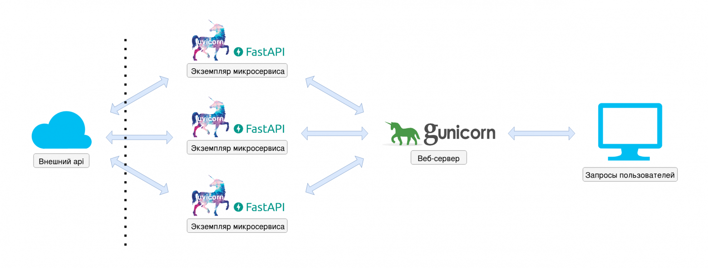

# Описание
Бэкенд для веб-сервиса сравнения цен, аналогичный сервису [Яндекс Товары](https://yandex.ru/products). Логика взаимодействия:
1. Представители магазинов загружают информацию о своих товарах и категориях. Также можно изменять и удалять информацию о ранее загруженных товарах и категориях.
2. Покупатели, пользуясь веб-приложением, могут искать предложения разных магазинов, сравнивать цены

Разработан REST API сервис, который позволяет магазинам загружать и обновлять информацию о товарах, а пользователям - смотреть какие товары были обновлены за последние сутки

Задание можно посмотреть в файле <code>Task.md</code>, а сами запросы и условия по ним в <code>openapi.yaml</code>

# Запуск

### Требования
Для запуска проекта надо, чтобы стоял docker с возможностью запуска через

```
foo@bar:~$ docker compose
...
```

Или docker-compose с docker

```
foo@bar:~$ docker-compose
...
```

### Запуск и информация по запуску
```console
foo@bar:~$ git clone git@github.com:MBHuman/YandeBackendTask.git
foo@bar:~$ cd YandeBackendTask
foo@bar:~$ docker-compose up -d
```

<b>Контейнеры автоматически перезапускаются</b>

В <code>docker-compose.yaml</code> файле заданы настройки запуска, настройки контейнеров лежат в папках <code>core</code> и <code>database</code> в файлах <code>Dockerfile</code>

FastAPI запускается на 80 порте

Tarantool запускается на 3301 порте

Для проверки работоспособности запросов и просмотра документации можно перейти в раздел документации REST API: <code> address:80/docs </code>

Подробную информацию по микросервисам можно найти в папках <code>core</code> и <code>database</code>


# Использованные технологии

### Языки программирования:

- Python ^3.7
- Lua

### Библиотеки:

- fastapi==0.74.0
- uvicorn==0.13.3
- loguru==0.5.3
- environs==9.3.0
- asynctnt==1.2.2
- gunicorn==20.1.0
- uvloop==0.16.0
- httptools==0.4.0
- httpx==0.23.0

### База данных:

- Tarantool v1

### Архитектура
Поставлено 14 воркеров в guvicorn, в соответствие числу выделенных потоков. Вместо внешнего api стоит in-memory база Tarantool

</img>

# Тестирование

| Запрос      | /imports | /delete | /nodes/{id} | /sales| /node/{id}/statistic |
|-------------|----------|---------|-------------|-------|----------------------|
| Реализованы | ✅       | ✅       | ✅          |✅     |          ❌           |

## Тесты запросов

### Базовые задачи

#### /imports 

Импортирует новые товары и/или категории. Товары/категории импортированные повторно обновляют текущие. Изменение типа элемента с товара на категорию или с категории на товар не допускается. Порядок элементов в запросе является произвольным.

- [x] uuid товара или категории является уникальным среди товаров и категорий
- [x] родителем товара или категории может быть только категория
- [x] принадлежность к категории определяется полем parentId
- [x] товар или категория могут не иметь родителя (при обновлении parentId на null, элемент остается без родителя)
- [x] название элемента не может быть null
- [x] у категорий поле price должно содержать null
- [x] цена товара не может быть null и должна быть больше либо равна нулю.
- [x] при обновлении товара/категории обновленными считаются **все** их параметры
- [x] при обновлении параметров элемента обязательно обновляется поле **date** в соответствии с временем обновления
- [x] в одном запросе не может быть двух элементов с одинаковым id
- [x] дата должна обрабатываться согласно ISO 8601 (такой придерживается OpenAPI). Если дата не удовлетворяет данному формату, необходимо отвечать 400.

#### /delete

- [x] Удалить элемент по идентификатору.
- [x] При удалении категории, удаляются все дочерние элементы
- [x] Так как время удаления не передается, при удалении элемента время обновления родителя изменять не нужно.

#### /nodes/{id}

- [x] Получить информацию об элементе по идентификатору.
- [x] При получении информации о категории также предоставляется информация о её дочерних элементах.
- [x] Для пустой категории поле children равно пустому массиву, а для товара равно null
- [x] цена категории - это средняя цена всех её товаров, включая товары дочерних категорий. Если категория не содержит товаров цена равна null. При обновлении цены товара, средняя цена категории, которая содержит этот товар, тоже обновляется.
### Дополнительные задачи

#### /sales

- [x] Получение списка **товаров**
- [x] Цена которых была обновлена за последние 24 часа включительно [now() - 24h, now()] от времени переданном в запросе. Обновление цены не означает её изменение. Обновления цен удаленных товаров недоступны. При обновлении цены товара, средняя цена категории, которая содержит этот товар, тоже обновляется.