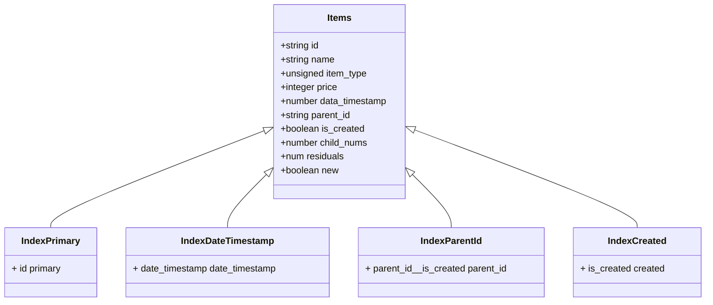
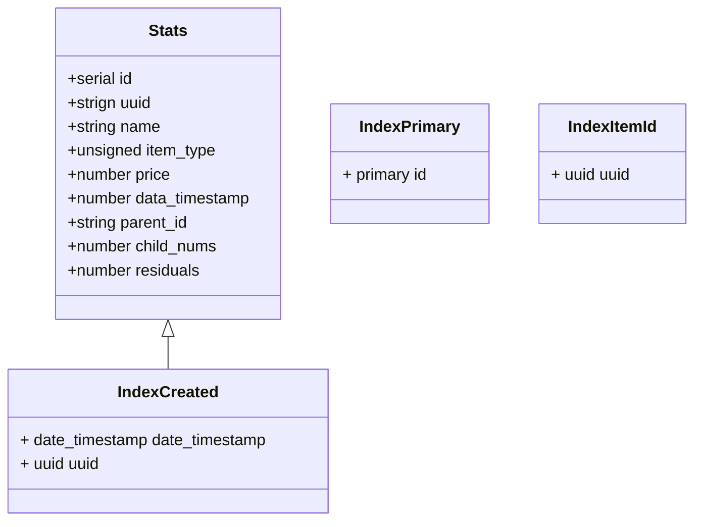

# Описание
<b>В Safari графики на mermaid не открываются, корректное отображение в Google Chrome</b>

В базе Tarantool можно на языке программирования Lua писать скрипты для запросов и делать бизнес логику, которую я опишу ниже.

## Идеи и реализации
Основная идея решения заключается в построении персистентного дерева с категориями и товарами, реализовать это можно с помощью построения одной таблицы <b>items</b> со следующей структурой и индексами, где индексы показаны стрелочкой к основной таблице. Для максимально эффективной работы можно использовать neo4j, так как данные в работе представляют собой граф, однако, так как у меня есть опыт работы на Tarantool, я решил реализовать бизнес логику на нём, так как там есть простой для понимания и написания язык программирования Lua на котором можно просто написать логику, которую я опишу полностью ниже.



Самым интересным представляется 5 запрос, реализовывать его я не буду, однако будет описана идея решения, которая позволнит реализовать его на любом из языков программирования с использованием нужной для работы базы данных.

Если делать 5 запрос ```/node/{id}/statistic```, понадобится вторая таблица, которая будет хранить информацию по изменениям элементов.

Она будет выглядет следующим образом.



В нашем случае будем хранить информацию в таблице по все uuid которые были, и добавлять их туда, когда произошло обновление, если элемент удаляется, то мы будем удалять информацию по статистике не в той же транзакции, чтобы не блокировать остальные запросы, а файбере, чтобы добиться максимальной производительности для работы REST API, в таком случае удаление будет работать максимально быстро, так как не будет затрагивать удаление всей статистики, которая была накоплена в результате работы API.

## Реализация запросов с идеями и псевдокодом

<b>Алгоритмы написаны на псевдокоде, похожем на Python</b>

Реализация логики запросов зависит от того сколько запросов вы хотите реализовать, для реализации 4 запросов хватит упрощённой логики, однако для работы 5 запроса все последующие запросы должны делать обновление в таблице со статистикой.


### /imports 

Простая реализация запроса, для раобты 1-4 запросов. HINT: в Tarantool нет очереди как в python, там есть продвинутые очереди для напсания MQ(трубы), чтобы не усложнять я использовал свою очередь, она находится в файле <code>util.lua</code>

Получение средней цены в простом запросе можно делать после того как были выгружены данные, просто пройтись по элементам и посчитать среднюю цену товаро в зависимости от того, сколько детей

```python

    class ITEM_TYPE(int, Enum):
        OFFER = 1
        CATEGORY = 2

    items = body.items
    updateDate = body.updateDate # Дата хранится в timestamp для удобства поиска, можно хранить и с помощью встроенных типов, однако для меня проще через unsigned

    is_validated = true

    # box.begin() Начинаем транзакцию, в случае проявления ошибки в транзакиц, все вставленные данные в базу должны быть удалены

    for item in items: # проверка на выполнение корректности вставленных данных
        id = item.id
        name = item.name
        parentId = item.parentId
        type = item.type
        price = item.price

        elem = item.primary:get(id) # Получение элемента из базы по id
        if elem:
            if elem.item_type != ITEM_TYPE(type):
                is_validated = False
            if elem.item_type == ITEM_TYPE.CATEGORY:
                items.primary:update(id, [('=', 'is_created', true)]) # делаем категорию созданной
        else:
            if ITEM_TYPE[type] == ITEM_TYPE.CATEGORY:
                items:insert([id, name, ITEM_TYPE.CATEGORY, None, updateDate, parentId, true, 0, 0, true])
            else:
                items:insert([id, name, ITEM_TYPE.OFFER, price, updateDate, parentId, true, 1, 0, true])


        if parentId is None:
            parent = items.primary:get(parentId)
            if parent:
                if parent.item_type ~= ITEM_TYPE.CATEGORY:
                    is_validated = False
            else:
                items:insert([parentId, '', ITEM_TYPE.CATEGORY, None, updateDate, None, False, 0, 0, true])


        if not is_validated:
            break

    undefinedElemsCount = items.created:count({false}) 
    """
        Считаем сколько элементов не было создано, так как могут быть созданы элементы родителей, 
        которых нет в базе, а это может привести к проблемам с получением информации через /node/{id} 
        с проблемной валидацией и последующей вставке в систему с ошибкой не тот тип.
    """
    if not is_validated or undefinedElemsCount != 0:
        raise Exception({code: 400, message: "Validation Falied"})

    """
        Проверка на валидацию закончена, все данные, которые были предоставлены, 
        были созданы в результате работы валидации и остаются с нами, если ошибки не было
    """

    for item in items:
        id = item.id
        name = item.name
        parentId = item.parentId
        type = item.type
        price = item.price

        info = items.primary:get(id)

        if type == 'OFFER':
            items.primary:update(id, [('=', 'price', price)])

        if parentId is None:
            items.primary:update(id, [('=', 'parentId', parentId)])
        
        items.primary:update(id, [('=', 'name', name), ('=', 'date_timestamp', updateDate)])

        # Обновляем дату всех родитилей, можно сделать с помощью dfs, bfs или похожим образом, чтобы не работать с рекурсией я решил воспользоваься bfs

        q = queue()
        q.append(id)

        while q:
            cur = q.popleft()
            elem = items.primary:get(cur)
            items.primary:update(cur, [('=', 'date_timestamp', updateDate)])
            if elem.parent_id is None:
                continue
            parent = items.primary:get(elem.parentId)
            if parent:
                q.append(parent.id)

    # box.commit() Завершаем транзакцию
```

Реализация запроса для работы 5

Для реализации 5 запроса надо внести несколько исправлений во вставку, а именно, при вставке пересчитавать среднее значение для категорий, хранить остатки от деления и число товаров в категориях

```python

    class ITEM_TYPE(int, Enum):
        OFFER = 1
        CATEGORY = 2

    items = body.items
    updateDate = body.updateDate

    # box.begin() Начинаем транзакцию, в случае проявления ошибки в транзакиц, все вставленные данные в базу должны быть удалены
    ... # Валидация будет проводиться аналогично, можно посмотреть работу выше

    for item in items:
        id = item.id
        name = item.name
        parentId = item.parentId
        type = item.type
        price = item.price

        info = items.primary:get(id)
        if !info.new:
            stats:insert([+serial, info.id, info.item_type, info.price, info.date_timestamp, info.parent_id, info.child_nums, info.residuals])

        # Убираем предыдущую среднеюю цену и число детей в нашем дереве


        if type == 'OFFER':
            if !info.new:

                q = queue()
                q.append(id)

                while q: # Убираем среднюю цену и уменьшаем число товаров у всех предков
                    cur = q.popleft()
                    elem = items.primary:get(cur)
                    if elem.parentId is None:
                        continue
                    parent = items.primary:get(elem.parentId)
                    if parent:
                        if parent.child_nums > 1:                                
                            cur_price = ((parent.price * parent.child_nums + parent.residuals) - elem.price) // (parent.child_nums - 1) # Думаю можно оптимизирвать, без умножения на число детей, чтобы было быстрее, но пока нет идей
                            cur_residual = ((parent.price * parent.child_nums + parent.residuals) - elem.price) % (parent.child_nums - 1)
                            items.primary:update(parent.id, [('=', 'price', None ), ('=', 'residuals', cur_residual), ('=', 'child_nums', parent.child_nums - 1)])
                        else:
                            cur_price = 0
                            cur_residual = 0
                            items.primary:update(parent.id, [('=', 'price', cur_price), ('=', 'residuals', cur_residual), ('=', 'child_nums', parent.child_nums - 1)])
                        q.append(parent.id)

            items.primary:update(id, [('=', 'price', price)])

        if parentId is None:
            items.primary:update(id, [('=', 'parentId', None)])
        else:
            items.primary:update(id, [('=', 'parentId', parentId)])
        
        # обновляем для новых предков

        q = queue()
        q.append(id)

        while q: # Убираем среднюю цену и уменьшаем число товаров у всех предков
            cur = q.popleft()
            elem = items.primary:get(cur)
            if elem.parentId is None:
                continue
            parent = items.primary:get(elem.parentId)
            if parent:                               
                cur_price = ((parent.price * parent.child_nums + parent.residuals) + elem.price) // (parent.child_nums + 1) # Думаю можно оптимизирвать, без умножения на число детей, чтобы было быстрее, но пока нет идей
                cur_residual = ((parent.price * parent.child_nums + parent.residuals) + elem.price) % (parent.child_nums + 1)
                items.primary:update(parent.id, [('=', 'price', cur_price), ('=', 'residuals', cur_residual), ('=', 'child_nums', parent.child_nums + 1)])
                q.append(parent.id)

        items.primary:update(id, [('=', 'name', name), ('=', 'date_timestamp', updateDate), ('=', 'new', false)])

        # Обновляем дату всех родитилей, можно сделать с помощью dfs, bfs или похожим образом, чтобы не работать с рекурсией я решил воспользоваься bfs

        q = queue()
        q.append(id)

        while q:
            cur = q.popleft()
            elem = items.primary:get(cur)
            items.primary:update(cur, [('=', 'date_timestamp', updateDate)])
            if elem.parent_id is None:
                continue
            parent = items.primary:get(elem.parentId)
            if parent:
                q.append(parent.id)
    

    # box.commit() Завершаем транзакцию
```


### /delete/{id}


Версия delete для простых запросов

```python

    id = query.id

    elem = items.primary:get(id)
    if elem is None:
        raise Error({code: 404, message: "Item not found"})

    q = queue()
    q.append(id)

    # box.begin() начинаем транзакцию

    while q:
        cur = q.popleft()
        items.primary:delete(cur)
        for _,  child in items.parent_id:pairs((cur, true)): # Итеротор в базе по все элементам
            q.append(child.id)

    # box.end() заканчиваем транзакцию

```

Версия для 5 запроса

```python

    id = query.id

    ... # Аналогично действиям в простом варианте

    def fiber():
        
        for _, elem in stats.itemId:pairs(id):
            stats.primary:delete(elem.id)
            yield_1000() # Остановка файбера, чтобы не мешать работе других запросов, удлаение статистики будет выполняться параллельно после того как мы удалим все элементы

    fiber.run(fiber()) # Запуск файбера в базе
```

### nodes/{id}

В случае с простым запросом можно получать информацию по категориям без средней цены, также будем указывать parent_id для того, чтобы восстановить дерево, если использовать продвинутую реализацию, она будет такая же, так как вложенность объектов надо реализовывать аналогично

```python

    id = body.query

    elem = items.primary:get(id)

    if elem is None:
        raise Error({code: 404, message: "Item not found"})

    result = []
    parent_id = -1

    q = queue()
    q.append((id, parent_id))

    while q:
        cur = q.popleft()

        data = items.primary:get(cur[0])
        if data is None:
            continue
        
        result.append((data, cur[1]))
        parent_id += 1
        for _, child in items.parent_id:pairs((cur[0], true)):
            q.append((child.id, parent_id))


    return result
```


### /sales

Чтобы получить статистику по товарам с изменённой ценой можно просто посмотреть все элементы, не однозначно написано в условии что за обновление, ведь за обновление можно считать цену нового товара, так как она тоже обновлена

```python

    class ITEM_TYPE(int, Enum):
        OFFER = 1
        CATEGORY = 2

    from_timestamp, to_timestamp = body.query()

    result = []

    for _, e in items.date_timestamp:pairs((to_timestamp, ITEM_TYPE.OFFER, {iterator='LE'})): # Итератор LowerEqual, чтобы взять все элементы включительно
        if e.date_timestamp < from_timestamp:
            break
        if e.item_type == ITEM_TYPE.OFFER:
            result.append(e)
        
    
    return result

```


### /node/{id}/statistic

Для получения статистики по времени надо проверить есть ли элемент в спейсе статистики и если он там находится, посмотреть все элементы, которые подходят по дате в статистике

```python

    id, dateStart, dateEnd = body.query()

    info = items.primary:get(id)
    if info is None:
        raise Error({code: 404, message: "Item not found"})
            
    result = []

    if info.date_timestamp < dateEnd and info.date_timestamp >= dateStart:
        result.append(info)

    for _, e in stats.date_timestamp:pairs((dateEnd, id), {iterator="LT"}): # Итеротор lower than
        if e.date_timestamp < dateStart:
            break
        if e.id == id:
            result.append(e)
    
    return result

```