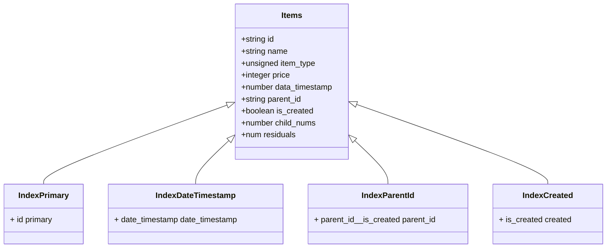

# Описание

В базе Tarantool можно на языке программирования Lua писать скрипты для запросов и делать бизнес логику.

## Идеи и реализации
Основная идея решения заключается в построении персистентного дерева с категориями и товарами, реализовать это можно с помощью построения одной таблицы <b>items</b> со следующей структурой и индексами 



Если делать 5 запрос ```/node/{id}/statistic```, понадобится вторая таблица, которая будет хранить информацию по изменениям элементов

Она будет выглядет следующим образом:

```mermaid
class Diagram
    class Items
    Items : +serial id -not NULL
    Items : +number child_nums -not NULL
    Items : +number residuals -not NULL 


```
